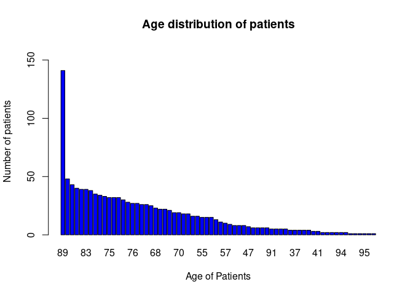
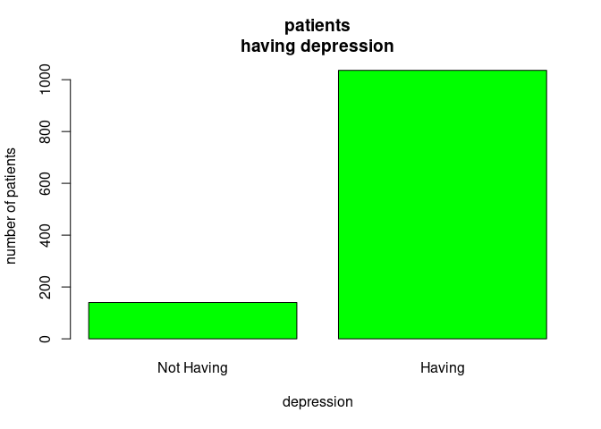

# Health Data Anlaysis


*image source: rand.org* *importing libraries*

``` r
library('doBy')
library('lattice')
library('dplyr')
```

    ## 
    ## Attaching package: 'dplyr'

    ## The following object is masked from 'package:doBy':
    ## 
    ##     order_by

    ## The following objects are masked from 'package:stats':
    ## 
    ##     filter, lag

    ## The following objects are masked from 'package:base':
    ## 
    ##     intersect, setdiff, setequal, union

``` r
library('tidyverse')
```

    ## ── Attaching packages ─────────────────────────────────────── tidyverse 1.3.1 ──

    ## ✔ ggplot2 3.3.6     ✔ purrr   0.3.4
    ## ✔ tibble  3.1.7     ✔ stringr 1.4.0
    ## ✔ tidyr   1.2.0     ✔ forcats 0.5.1
    ## ✔ readr   2.1.2

    ## ── Conflicts ────────────────────────────────────────── tidyverse_conflicts() ──
    ## ✖ dplyr::filter()   masks stats::filter()
    ## ✖ dplyr::lag()      masks stats::lag()
    ## ✖ dplyr::order_by() masks doBy::order_by()

``` r
library(data.table)
```

    ## 
    ## Attaching package: 'data.table'

    ## The following object is masked from 'package:purrr':
    ## 
    ##     transpose

    ## The following objects are masked from 'package:dplyr':
    ## 
    ##     between, first, last

**Loading Data Set**

``` r
health_rec <- read.table('https://raw.githubusercontent.com/xrander/Health-data/master/Health_data.csv',
           header = T,
           sep = ',',
           na.strings = NA,
           dec = '.',
           strip.white = T)

health_rec <- setDT(health_rec)
head(health_rec)
```

    ##    group_num     ID outcome age gender      BMI hypertensive atrialfibrillation
    ## 1:         1 125047       0  72      1 37.58818            0                  0
    ## 2:         1 139812       0  75      2       NA            0                  0
    ## 3:         1 109787       0  83      2 26.57263            0                  0
    ## 4:         1 130587       0  43      2 83.26463            0                  0
    ## 5:         1 138290       0  75      2 31.82484            1                  0
    ## 6:         1 154653       0  76      1 24.26229            1                  1
    ##    CHD_with_no_MI diabetes deficiencyanemias depression Hyperlipemia
    ## 1:              0        1                 1          0            1
    ## 2:              0        0                 1          0            0
    ## 3:              0        0                 1          0            0
    ## 4:              0        0                 0          0            0
    ## 5:              0        0                 1          0            0
    ## 6:              0        0                 1          0            1
    ##    Renal_failure COPD heart_rate Systolic_blood_pressure
    ## 1:             1    0   68.83784                155.8667
    ## 2:             0    1  101.37037                140.0000
    ## 3:             1    0   72.31818                135.3333
    ## 4:             0    0   94.50000                126.4000
    ## 5:             1    1   67.92000                156.5600
    ## 6:             1    1   74.18182                118.1000
    ##    Diastolic_blood_pressure Respiratory_rate temperature    SP_O2 Urine_output
    ## 1:                 68.33333         16.62162    36.71429 98.39474         2155
    ## 2:                 65.00000         20.85185    36.68254 96.92308         1425
    ## 3:                 61.37500         23.64000    36.45370 95.29167         2425
    ## 4:                 73.20000         21.85714    36.28704 93.84615         8760
    ## 5:                 58.12000         21.36000    36.76190 99.28000         4455
    ## 6:                 52.95000         20.54545    35.26667 96.81818         1840
    ##    hematocrit      RBC      MCH     MCHC     MCV      RDW Leucocyte Platelets
    ## 1:   26.27273 2.960000 28.25000 31.52000  89.900 16.22000  7.650000   305.100
    ## 2:   30.78000 3.138000 31.06000 31.66000  98.200 14.26000 12.740000   246.400
    ## 3:   27.70000 2.620000 34.32000 31.30000 109.800 23.82000  5.480000   204.200
    ## 4:   36.63750 4.277500 26.06250 30.41250  85.625 17.03750  8.225000   216.375
    ## 5:   29.93333 3.286667 30.66667 33.66667  91.000 16.26667  8.833333   251.000
    ## 6:   27.33333 3.235000 26.56667 31.48333  84.500 16.51667  9.516667   273.000
    ##    Neutrophils Basophils Lymphocyte       PT      INR NT_proBNP Creatine_kinase
    ## 1:       74.65      0.40       13.3 10.60000 1.000000      1956        148.0000
    ## 2:          NA        NA         NA       NA       NA      2384         60.6000
    ## 3:       68.10      0.55       24.5 11.27500 0.950000      4081         16.0000
    ## 4:       81.80      0.15       14.5 27.06667 2.666667       668         85.0000
    ## 5:          NA        NA         NA       NA       NA     30802        111.6667
    ## 6:       85.40      0.30        9.3 18.78333 1.700000     34183         28.0000
    ##    Creatinine Urea_nitrogen   glucose Blood_potassium Blood_sodium
    ## 1:  1.9583333      50.00000 114.63636        4.816667     138.7500
    ## 2:  1.1222222      20.33333 147.50000        4.450000     138.8889
    ## 3:  1.8714286      33.85714 149.00000        5.825000     140.7143
    ## 4:  0.5857143      15.28571 128.25000        4.386667     138.5000
    ## 5:  1.9500000      43.00000 145.75000        4.783333     136.6667
    ## 6:  1.6125000      26.62500  98.33333        4.075000     136.2500
    ##    Blood_calcium  Chloride Anion_gap Magnesium_ion    PH Bicarbonate
    ## 1:      7.463636 109.16667  13.16667      2.618182 7.230    21.16667
    ## 2:      8.162500  98.44444  11.44444      1.887500 7.225    33.44444
    ## 3:      8.266667 105.85714  10.00000      2.157143 7.268    30.57143
    ## 4:      9.476923  92.07143  12.35714      1.942857 7.370    38.57143
    ## 5:      8.733333 104.50000  15.16667      1.650000 7.250    22.00000
    ## 6:      8.466667  96.75000  13.12500      1.771429 7.310    30.50000
    ##    Lactic_acid PCO2 EF
    ## 1:         0.5 40.0 55
    ## 2:         0.5 78.0 55
    ## 3:         0.5 71.5 35
    ## 4:         0.6 75.0 55
    ## 5:         0.6 50.0 55
    ## 6:         0.6 65.5 35

##Data Explorartion

``` r
str(health_rec) # data structure

summary(health_rec) # quick statistics

nrow(health_rec)
```

## Dealing with NA’s for outcome

Some of the data is having NA, that happens in big data, outcome is the
most important here and cannot be left as NA

``` r
health_rec[is.na(health_rec$outcome),]
```

    ##    group_num     ID outcome age gender BMI hypertensive atrialfibrillation
    ## 1:         2 162338      NA  83      1  NA            1                  0
    ##    CHD_with_no_MI diabetes deficiencyanemias depression Hyperlipemia
    ## 1:              0        1                 0          0            0
    ##    Renal_failure COPD heart_rate Systolic_blood_pressure
    ## 1:             1    0         NA                      NA
    ##    Diastolic_blood_pressure Respiratory_rate temperature SP_O2 Urine_output
    ## 1:                       NA               NA          NA    NA           NA
    ##    hematocrit    RBC  MCH    MCHC    MCV  RDW Leucocyte Platelets Neutrophils
    ## 1:    35.9125 3.9375 29.7 32.5625 91.375 15.1      8.25       226          78
    ##    Basophils Lymphocyte   PT       INR NT_proBNP Creatine_kinase Creatinine
    ## 1:       0.3      12.55 11.3 0.9333333   14649.5            82.4     4.2125
    ##    Urea_nitrogen glucose Blood_potassium Blood_sodium Blood_calcium Chloride
    ## 1:            42      NA          4.4375     130.6667          7.45   92.625
    ##    Anion_gap Magnesium_ion PH Bicarbonate Lactic_acid PCO2 EF
    ## 1:      15.5      1.983333 NA        26.5          NA   NA 55

``` r
health_rec <- health_rec[!is.na(health_rec$outcome),] #removing the missing outcome data

length(health_rec$outcome) 
```

    ## [1] 1176

There is no missing data again in the part of the outcome. – The data
have reduced to 1176 from 1177

## Data transformation

some data are categorical data and they’ve been changed to factor type
of data

``` r
health_rec$outcome  <-as.factor(health_rec$outcome)
health_rec$gender <- as.factor(health_rec$gender)
health_rec$COPD <- as.factor(health_rec$COPD)
health_rec$Renal_failure <-as.factor(health_rec$Renal_failure)
health_rec$hypertensive <- as.factor(health_rec$hypertensive)
health_rec$atrialfibrillation <- as.factor(health_rec$atrialfibrillation)
health_rec$CHD_with_no_MI <- as.factor(health_rec$CHD_with_no_MI)
health_rec$diabetes <- as.factor(health_rec$diabetes)
health_rec$deficiencyanemias <- as.factor(health_rec$deficiencyanemias)
health_rec$depression <- as.factor(health_rec$depression)
health_rec$Hyperlipemia <- as.factor(health_rec$Hyperlipemia)
health_rec$Renal_failure <- as.factor(health_rec$Renal_failure)
```

# Assigning values to codes

We assigned some values to the codes to aid easy analysis

``` r
health_rec$outcome <- ifelse(health_rec$outcome == '0', 'Alive', 'Dead')
health_rec$gender <- ifelse(health_rec$gender == '1', 'Male', 'Female')
health_rec$atrialfibrillation <- ifelse(health_rec$atrialfibrillation == '0',
                                        'Having', 'Not having')
health_rec$depression <- ifelse(health_rec$depression == 0, 'Having',
                                'Not Having')
health_rec$hypertensive <- ifelse(health_rec$hypertensive == '0', 
                                  'Having','Not Having')
health_rec$Renal_failure <- ifelse(health_rec$Renal_failure == '0',
                                   'Not having','Having')
health_rec$Hyperlipemia <- ifelse(health_rec$Hyperlipemia == 0,
                                  'Having','Not Having')
health_rec$deficiencyanemias <- ifelse(health_rec$deficiencyanemia == 0,
                                       'Having', 'Not Having')
health_rec$diabetes <- ifelse(health_rec$diabetes== 0, 'Having','Not Having')
```

------------------------------------------------------------------------

# QUESTIONS

## Question 1

Which age is the most in the hospital?

``` r
sort(table(health_rec$age), decreasing = T)
```

    ## 
    ##  89  84  81  80  78  83  85  79  82  87  75  77  86  72  66  76  88  63  64  69 
    ## 141  48  43  40  39  39  38  35  34  33  32  32  32  30  28  27  27  26  26  25 
    ##  68  67  71  65  62  70  73  74  53  56  55  60  61  58  48  57  52  51  54  59 
    ##  23  22  22  21  19  19  18  18  16  16  15  15  15  13  11  10   9   8   8   8 
    ##  47  45  46  50  90  91  92  93  96  35  37  42  43  44  38  41  19  39  40  49 
    ##   7   6   6   6   6   5   5   5   5   4   4   4   4   4   3   3   2   2   2   2 
    ##  94  97  25  28  32  95  98  99 
    ##   2   2   1   1   1   1   1   1

``` r
# Visuals
barplot(sort(table(health_rec$age), decreasing = T),
        col = 'blue',
        main = 'Age distribution of patients',
        ylim = c(0, 160),
        ylab = 'Number of patients',
        xlab = 'Age of Patients')
```



**ANSWER** Patients that are 89 years of age are the highest.

### Question 1b

Which age group is the most in the hospital?

``` r
breaks <- seq(from = 1, to = max(health_rec$age), by = 10) #this starts 
#at the lowest age and ends at the lowest
  
age_interval <- cut(health_rec$age, breaks = breaks,
                    right = FALSE,
                    include.lowest = TRUE) # this makes the class interval from the list
age_group <- cbind(data.frame(age_interval))

age_groups <- sort(table(age_interval), decreasing = T) # generating frequency table

barchart(age_groups,
         horizontal = FALSE,
         xlab = 'Age_interval',
         ylab = 'Frequency',
         ylim = c(0, 450),
         col = 'red')
```


**ANSWER** Patients between the age 81 to 91 are the highest in the
hospital with age 89 been the highest

## Question 2

which age group of patients dies more in the hospital?

``` r
dead_patients <- health_rec[outcome == "Dead",c("outcome","age","gender") ]
```

The result shows the frequency table for dead patients according to age.

``` r
barplot(sort(table(dead_patients$age)),
        col = 'purple',
        xlab = 'age (years)',
        ylab = 'Frequency',
        main = 'Distribution of Age for Dead Patients',
        ylim = c(0, 30))
```


**ANSWER** Patients at age 89 are the highest to die, with 23 patients
dying

## Question 3:

What is the most prevalent gender in the hospital

``` r
gender <- as.data.frame(sort(table(health_rec$gender), decreasing = T)) # This gives a frequency of the genders
  ## Female gender is more prevalent with 618 patients

colnames(gender) <- c('gender','num') #changing column names
```

### Question 3b:

what is the death rate of both gender

``` r
gender_dead_count <- as.data.frame(sort(table(dead_patients$gender))) #Frequency for dead patients according to gender
colnames(gender_dead_count) <- c('gender', 'count')

gender[3] <- gender_dead_count$count

names(gender)[3] <- 'dead' # this is similar to using colnames

gender$rate <- gender$dead/gender$num * 100 #rate of death per hundred
```

It seems the male gender is having more dead rate than female

``` r
barplot(gender$rate,
        names.arg = gender$gender,
        xlab = substitute(paste(bold('gender'))),
        ylab = substitute(paste(bold('death rate per hundred'))),
        main = 'Death rate of genders',
        col = c(5,7))
```


## Question 4

Gender group with the highest number of death?

``` r
sort(table((dead_patients$gender)), decreasing = T)
```

    ## 
    ##   Male Female 
    ##     80     79

the gender with the highest death is male with 80 individuals dead

------------------------------------------------------------------------

## Question 5

How many patients died in the hospital with atrialfibrillation?

``` r
dead_patients_atrial <- as.data.frame(health_rec %>% select(outcome, atrialfibrillation) %>% 
  filter(outcome == 'Dead') %>% group_by(atrialfibrillation)%>%
  summarize(length = length(atrialfibrillation)))

dead_patients_atrial
```

    ##   atrialfibrillation length
    ## 1             Having     67
    ## 2         Not having     92

67 patients died having atrialfibrillation

### Question 5b

patients having atrialfibrillation

``` r
atrial <- as.data.frame(health_rec %>% select(gender, atrialfibrillation) %>% 
  filter(atrialfibrillation == 'Having') %>% group_by(gender)%>%
  summarize(atrial = length(atrialfibrillation))) # this gets the number of having atril... for each gender

gender <- merge(gender, atrial, by = 'gender', all = T)
```

645 is the number of patients having atrialfibrillation

### Question 5c

Number of patients that died between the gender having
atrialfibrillation

``` r
dead_patients_atrial_gender <-
as.data.frame(health_rec %>% select(outcome, gender,
atrialfibrillation) %>% filter(outcome == 'Dead',
atrialfibrillation=='Having') %>% group_by(gender) %>%
summarize(died_having_atrial = length(gender)))

dead_patients_atrial_gender
```

    ##   gender died_having_atrial
    ## 1 Female                 39
    ## 2   Male                 28

39 female and 28 male died having atrialfibrillation

``` r
gender <- merge(gender,
dead_patients_atrial_gender, by = 'gender', all = TRUE)
```

merging the result to gender table

################################################################################ 

## Question 6

How many patients in the hospital have depression?

``` r
(sort(table(health_rec$depression)))  
```

    ## 
    ## Not Having     Having 
    ##        140       1036

``` r
barplot(sort(table(health_rec$depression)),
ylab = 'number of patients', xlab = 'depression', main = 'patients
having depression', col = 'green')
```

 1036
out of 1176 patients are having depression

### Question 6b1

show the total number of depressed male and female

``` r
depressed_individuals <- health_rec %>% select(gender, depression)%>%
  filter(depression == 'Having') %>% 
  group_by(gender) %>%
  summarize(depressed_individuals = length(depression))
depressed_individuals
```

    ## # A tibble: 2 × 2
    ##   gender depressed_individuals
    ##   <chr>                  <int>
    ## 1 Female                   529
    ## 2 Male                     507

``` r
gender <- merge(gender, depressed_individuals, by = 'gender', all =
TRUE) #merging result to gender table
```

#### Question 6b2

show the number of patients having depression that are dead according to
gender.

``` r
dead_depressed <- as.data.frame(health_rec %>%
                                  select(outcome, gender, depression) %>%
                                  filter(outcome == 'Dead', depression == 'Having') %>%
                                  group_by(gender) %>%
                                  summarize(depressed_and_dead =length(depression)))
dead_depressed
```

    ##   gender depressed_and_dead
    ## 1 Female                 71
    ## 2   Male                 77

``` r
gender <- merge(gender, dead_depressed, by = 'gender', all =
TRUE) # merging the result to gender table
```

``` r
barchart(depressed_and_dead~gender,
         data = dead_depressed,
         ylim = c(0,90),
         col = 'purple') ## show data value on the chart
```

 \###
Question 6c Show the number of dead patients having or not having
depression according to the genders

``` r
dep_not_dep<- as.data.frame(health_rec %>%
                              select(outcome, gender, depression) %>%
                              filter(outcome == 'Dead') %>%
                              group_by(gender, depression) %>%
                              summarize(num_of_patients = length(depression)))
```

    ## `summarise()` has grouped output by 'gender'. You can override using the
    ## `.groups` argument.

``` r
dep_not_dep
```

    ##   gender depression num_of_patients
    ## 1 Female     Having              71
    ## 2 Female Not Having               8
    ## 3   Male     Having              77
    ## 4   Male Not Having               3

``` r
barchart(num_of_patients~depression|gender,
         data = dep_not_dep,
         group= depression,
         xlab = substitute(paste(bold('Depression'))),
         ylab = substitute(paste(bold('Number of patients'))))
```


## Question 8

what is the rate of non-survived patients with hypertension?

``` r
dead_hyper <- health_rec %>%
  select(outcome, hypertensive) %>%
  filter(hypertensive == 'Having', outcome == 'Dead') %>%
  summarize(dead_hypertensive = length(hypertensive)) # this returns the patients that are dead and had hypertension

hypertensive <- health_rec %>%
  select(outcome, hypertensive) %>%
  filter(hypertensive == 'Having') %>%
  summarize(hypertensive = length(hypertensive)) #this returns all the patients with hypertension

dead_hyper$dead_hypertensive/  hypertensive$hypertensive * 100 #proportion of the dead hypertensive patients
```

    ## [1] 17.46988

# Question 9

Rate of the different gender with hypertension per 100 patients

``` r
gender_hyper <- as.data.frame(health_rec %>% select(gender,
hypertensive) %>% filter (hypertensive == 'Having') %>%
group_by(gender) %>% summarize (hypertensive_tot =
length(hypertensive)))

gender <- merge(gender, gender_hyper, by = 'gender', all = T) #merging to gender
gender$rate_hyper <- gender$hypertensive_tot/gender$num * 100 ##estimating the rate
```

``` r
gender[, c('gender','rate_hyper')]
```

    ##   gender rate_hyper
    ## 1 Female   27.83172
    ## 2   Male   28.67384

**ANSWER** 28 female and 29 male patients per 100 are having
hypertension

###Question 9b patients having hypertension and dead

``` r
dead_gender_hyper <- as.data.frame(health_rec %>%
                                     select(outcome,gender, hypertensive)%>%
                                     filter (outcome == 'Dead',hypertensive == 'Having') %>%
                                     group_by(gender) %>%
                                     summarize (hypertensive_dead = length(hypertensive))) # this separates the dead hypertensive patients according to gender
```

**ANSWER** 31 female and 27 male of the dead patients had hypertension

``` r
gender <- merge(gender, dead_gender_hyper, by = 'gender', all = T)
```

## Question 10

How many patients with renal failure are alive in the hospital?

``` r
health_rec %>%
  select(outcome, Renal_failure) %>%
  filter(outcome == 'Alive', Renal_failure == 'Having') %>%
  summarise(length(Renal_failure))
```

    ##   length(Renal_failure)
    ## 1                   392

**ANSWER** 392 patients are having renal failure and alive \### Question
10b How many patients died having renal failure

``` r
health_rec %>%
  select(outcome, Renal_failure) %>%
  filter(outcome == 'Dead', Renal_failure == 'Having') %>%
  summarise(length(Renal_failure))
```

    ##   length(Renal_failure)
    ## 1                    37

**ANSWER**37 patients died having renal failure

### Question 10C1

People with renal failure according to gender

``` r
renal <- as.data.frame(health_rec %>%
     select(gender, Renal_failure)%>%
     filter(Renal_failure == 'Having') %>%
     group_by(gender) %>%
     summarise(renal_failure = length(Renal_failure)))

renal
```

    ##   gender renal_failure
    ## 1 Female           198
    ## 2   Male           231

``` r
gender <- merge(gender, renal, by = 'gender', all = T) #merging result to gender dataframe
```

#### 10C2

num of patients that died having renal failure according to gender

``` r
renal_dead <- as.data.frame(health_rec %>% select(outcome,
gender,Renal_failure) %>% filter(outcome == 'Dead', Renal_failure ==
'Having') %>% group_by(gender) %>% summarise(length(Renal_failure)))
```

``` r
gender <- merge(gender, renal_dead, by = 'gender', all = T) #merging result to gender dataframe
```

------------------------------------------------------------------------

## Question 11

How many patients in the hospital with Hyperlipemia are dead?

``` r
dead_hyperli <- as.data.frame(health_rec %>%
                                select(outcome, gender, Hyperlipemia) %>%
                                filter(outcome == 'Dead', Hyperlipemia == 'Having') %>%
                                group_by(gender) %>%
                                summarize (dead_hyperli = length(Hyperlipemia)))

gender <- merge(gender, dead_hyperli, by = 'gender', all = T) # merging to gender
```

**ANSWER** `rsum(gender$dead_hyperli)` patients died having
hyperlipermia

### Question 11b

How many patients are having hyperlipemia

``` r
hyperli <- as.data.frame(health_rec %>%
                           select(gender, Hyperlipemia) %>%
                           filter(Hyperlipemia == 'Having') %>%
                           group_by(gender) %>% 
                           summarize(hyperlip = length(Hyperlipemia)))
```

729 patients are having hyperlipermia

``` r
gender <- merge(gender, hyperli, by = 'gender', all = T) # merging to gender
```

## Question 12

how many patients in the hospital with Anemia are dead?

``` r
anemia <- as.data.frame(health_rec %>%
                          select(outcome, gender, deficiencyanemias) %>%
                          filter(outcome == 'Dead', deficiencyanemias == 'Having') %>%
                          group_by(gender) %>%
                          summarise(anemia_dead = length(deficiencyanemias)))
gender<- merge(gender, anemia, by = 'gender', all = T) # merging to gender 
```

124 is the sum of dead patients having anemia

### Question 12b

Total sum of patients having anemia

``` r
anemia_tot <- as.data.frame(health_rec %>%
        select(gender,deficiencyanemias) %>%
        filter(deficiencyanemias == 'Having') %>%
        group_by(gender) %>%
        summarise(anemia_tot = length(deficiencyanemias)))

gender <- merge(gender, anemia_tot, by = 'gender', all = T) #merging to gender
```

777 patients is having anemia

------------------------------------------------------------------------

## 13

What is the proportion of survival and non-survival between diabetic and
non-diabetic patients

***Short preview of the stats relating to diabetic patients***

``` r
health_rec %>% select(outcome, diabetes) %>% group_by(outcome,
diabetes) %>% summarize(count = length(diabetes))
```

    ## `summarise()` has grouped output by 'outcome'. You can override using the
    ## `.groups` argument.

    ## # A tibble: 4 × 3
    ## # Groups:   outcome [2]
    ##   outcome diabetes   count
    ##   <chr>   <chr>      <int>
    ## 1 Alive   Having       579
    ## 2 Alive   Not Having   438
    ## 3 Dead    Having       102
    ## 4 Dead    Not Having    57

### 13a1

The proportion of patients having diabetes

``` r
diabeteic <- as.data.frame(health_rec %>% 
                             select(diabetes) %>%
                             filter(diabetes == 'Having') %>% 
                             summarize(length(diabetes))) # this returns the total number of diabetic patients

diabeteic$`length(diabetes)`/length(health_rec$outcome) # this returns the percentage of diabetic patients
```

    ## [1] 0.5790816

**ANSWER** 57.9% of the patients are diabetic

### 13b

Proportion of diabetic that survived To get the proportion of diabetic
patient that survived, we need to know the total number of people having
diabetic and we divide that by the number of people having diabetes and
survived

``` r
having_diabetes_alive <- as.data.frame(health_rec %>%
   select(outcome, diabetes) %>%
   filter(outcome == 'Alive', diabetes == 'Having') %>%
   summarize(having_diabetes = length(diabetes))) # returns the patients having diabetes and still alive
  
having_diabetes <- as.data.frame(health_rec %>%
   select(diabetes) %>%
   filter(diabetes == 'Having') %>%
   summarize(diabetic = length(diabetes))) # returns patients having diabetes dead or alive

having_diabetes_alive$having_diabetes/having_diabetes$diabetic * 100 # proportion of diabetic patients alive
```

    ## [1] 85.02203

**ANSWER** 85% of diabetic patients are alive

#### 13b2

Proportion of non-diabetic that survived. For this we follow the same
procedure as the one above but this time, the patients are not diabetic

``` r
non_diabetic_alive <- health_rec %>% 
  select(outcome, diabetes) %>%
  filter(outcome == 'Alive', diabetes == 'Not Having') %>%
  summarize(non_diabetes = length(diabetes)) # this returns non-diabetic patients that are alive

non_diabetic <- health_rec %>%
  select(diabetes) %>%
  filter(diabetes == 'Not Having') %>%
  summarize(non_diabetic = length(diabetes)) #this returns non-diabetic dead or alive

non_diabetic_alive$non_diabetes/non_diabetic$non_diabetic * 100 # this returns the proportion of non-diabetic that are alive 
```

    ## [1] 88.48485

**ANSWER**88.4848485% of the patients are not having diabetes and are
alive

### 13c

Proportion of diabetic that died

``` r
dead_diabetic <- health_rec %>%
  select(outcome, diabetes) %>%
  filter(diabetes == 'Having', outcome == 'Dead') %>%
  summarize (diabetic = length(diabetes)) # num of dead diabetic patients

dead_diabetic$diabetic/having_diabetes$diabetic * 100 #this returns the proportion of dead diabetics 
```

    ## [1] 14.97797

**ANSWER** about 14.98 percent of the diabetics are dead

#### 13c2

Proportion of non_diabetic that died

``` r
dead_non_diabetic <- health_rec %>% 
  select(outcome, diabetes) %>%
  filter(diabetes == 'Not Having', outcome == 'Dead') %>%
  summarize (non_diabetic=length(diabetes)) # num of dead non-diabetic patients

dead_non_diabetic$non_diabetic/non_diabetic$non_diabetic * 100 # this returns the proportion of dead non-diabetics
```

    ## [1] 11.51515

**ANSWER** 11.52 percent of non diabetics are dead.

## Question 14

What is the proportion of survival and non-survival between depressed
and non-depressed patients

***Short preview of the stats relating to depressed patients***

``` r
health_rec %>% select(outcome, depression) %>%
  group_by(outcome, depression) %>%
  summarize(count = length(outcome))
```

    ## `summarise()` has grouped output by 'outcome'. You can override using the
    ## `.groups` argument.

    ## # A tibble: 4 × 3
    ## # Groups:   outcome [2]
    ##   outcome depression count
    ##   <chr>   <chr>      <int>
    ## 1 Alive   Having       888
    ## 2 Alive   Not Having   129
    ## 3 Dead    Having       148
    ## 4 Dead    Not Having    11

## Question 14a

What is the proportion of depressed and non-depressed that survived

``` r
depressed <- as.data.frame(health_rec %>% 
   select(depression) %>% 
   filter(depression == 'Having') %>%
   summarize(depressed = length(depression))) # this returns the total number of depressed patients either dead or alive

depressed$depressed/length(health_rec$outcome) # this returns the percentage of depressed patients
```

    ## [1] 0.8809524

**ANSWER**88.1 percent of the patients are depressed

### 14a1

Proportion of depressed patients that survived

``` r
having_depression_alive <- as.data.frame(health_rec %>% 
     select(outcome, depression) %>%
     filter(outcome == 'Alive', depression == 'Having') %>%
     summarize(having_depression = length(depression))) # returns the patients having depression and still alive

having_depression_alive$having_depression/depressed$depressed * 100 # proportion of depressed patients alive
```

    ## [1] 85.71429

**ANSWER** 85.7% of depressed patients are alive

#### 14a2

Proportion of non-depressed that survived For this we follow the same
procedure as the one above but this time, the patients are not depressed

``` r
non_depressed_alive <- health_rec %>%
  select(outcome, depression) %>%
  filter(outcome == 'Alive', depression == 'Not Having') %>%
  summarize(non_depression = length(depression)) #this returns non-depressed patients that are alive

non_depressed <- health_rec %>% select(depression) %>%
filter(depression == 'Not Having') %>% summarize(non_depressed =
length(depression)) #this returns non-depressed patients count dead or alive

non_depressed_alive$non_depression/non_depressed$non_depressed * 100 # this returns the proportion of non-depressed patients that are alive
```

    ## [1] 92.14286

**ANSWER**92.1% percent of the patients are not having depression and
are alive

### 14b1

Proportion of depressed patients that died

``` r
dead_depressed <-health_rec %>%
  select(outcome, depression) %>%
  filter(depression == 'Having', outcome == 'Dead') %>% 
  summarize (depressed = length(depression)) # num of dead depressed patients

dead_depressed$depressed/depressed$depressed * 100 #this returns the proportion of dead depressed patients
```

    ## [1] 14.28571

**ANSWER** about 14.28 percent of the depressed patients are dead

#### 14b2

Proportion of non_depressed patients that died

``` r
dead_non_depressed <- health_rec %>% 
  select(outcome, depression) %>% 
  filter(depression== 'Not Having', outcome == 'Dead') %>% 
  summarize(non_depressed=length(depression)) # num of dead non-diabetic patients

dead_non_depressed$non_depressed/non_depressed$non_depressed * 100 # this returns the proportion of dead non-diabetics 
```

    ## [1] 7.857143

**ANSWER** 7.86 percent of the non-depressed patients are dead.

# Check the number of patients having more than one health problem
